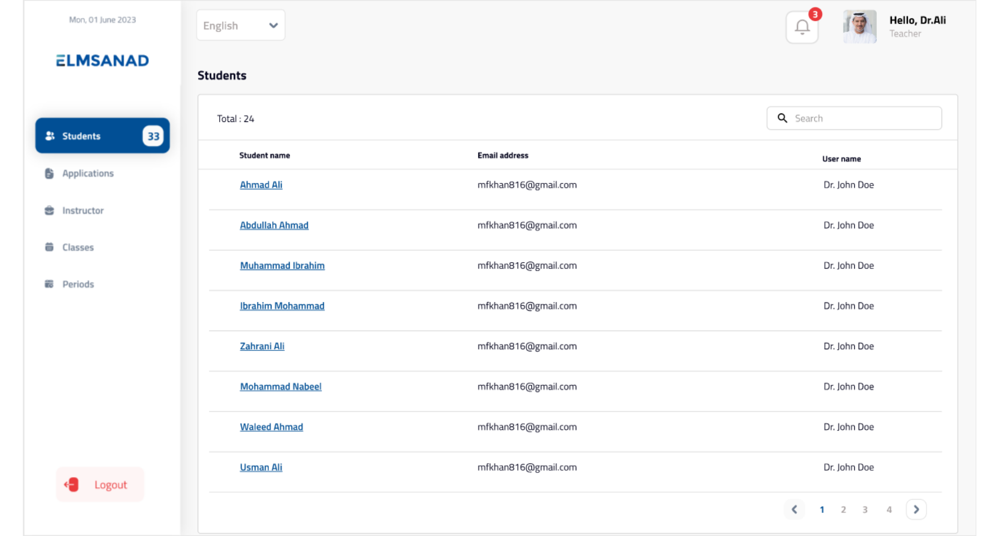

# ELMSANAD

INTRODUCTION

This case study presents an educational platform that merges a Student Information System (SIS) and Learning Management System (LMS) with blockchain for secure grading. It features dedicated portals for users and includes key functions like assignment submission, enhancing trust and integrity in the academic ecosystem.

SYSTEM FEATURES

1. Degree Structure Management
2. Quizes Management
3. Assigment Management
4. Admissions Management
5. Online Sessions
6. Faculty Management

TECNICALITIES/TOOLS USED

1. ASP.NET
2. ReactJS
3. Webhooks
4. SAAS Architecture
5. GraphQL APIs
6. Blockchain

SYSTEM SCREENSHOTS

 

